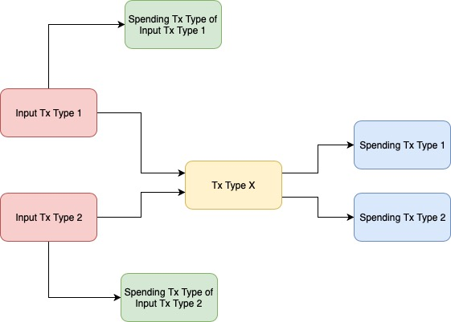
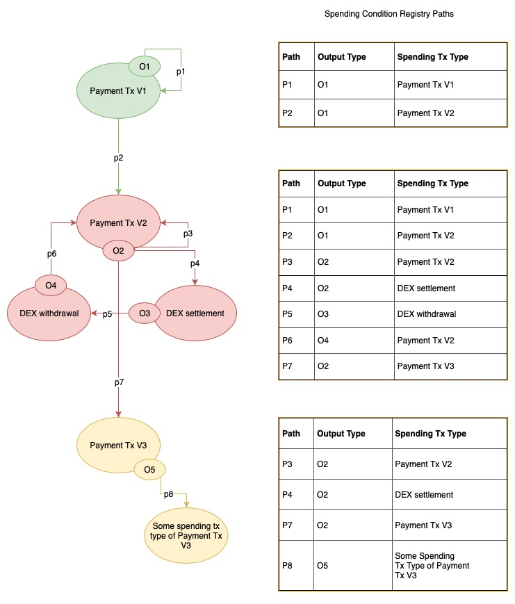

# Tx Types dependencies

In an ideal word, whenever we want to expend the features to the Plasma Framework, we just need to add and register a new the Exit Game contract. However, in practice, this is not as trivial since there are some dependencies across tx types and output types due to the M(ore)VP protocol design, especially for in-flight exit protocol.

In the in-flight exit game, we have two kinds of challenges (challenge piggyback input already spend + challenge non canonical) that would be challenging around the input of the in-flight tx. This brings all dependency of inputs' tx types to the current tx type as well. For instance, if an input tx type 1 has multiple dependencies (tx type 2, 3, 4) that can spend it. And our current tx type 2 can only be spend by tx type 5. However, the Exit Game contract of tx type 2 would still need to know how a tx-type-1 tx can be spend in tx type 3 and 4 too.

In conclusion, one tx type would not only have dependencies on how the tx type can be spend, but also how the input can be spend.



## Code design to keep things flexible with the tx type dependencies

We have two designs to keep us in a more flexible situation when we want to do an extension. We have the concept of `SpendingConditionRegistry` and `WireTransaction` to abstract things out.

### Spending Condition Registry

Original discussion: https://github.com/omisego/plasma-contracts/issues/214

This is a registry contract that we can describe the required dependencies graph of the spending condition. It is designed to use `(outputType, spendingTxType)` as key to describe how an output type can be spend in a spending transaction type. `outputType` is chosen since there can be multiple `outputType` of a `txType`. However, to keep things simple, we assumes **all new tx type would provide new output types**. So there would be no single output type being used in two tx types.

Following is an example of how spending condition registry would be representing the tx types dependency graph. The example here uses the the idea of [restricted custody DEX design](https://github.com/omisego/docs/blob/master/docs/restricted_custody_mvp1_spec.md). However, it is not limited to that, just using that as an example:




As you can see, the spending condition would need to take the input tx type into consideration as well. So a spending condition registry of `Payment Tx V2` would still need to register the path for `Payment Tx V1`. Same for V3, it would need all paths related to `O2`.

### Wire Transaction Format

Aside from the dependency of the path that a tx type can be spend, there is also data structure dependency. To be able to process a tx, one would need to decode the transaction and thus need to know what are the fields of the transactions.

#### Transaction Format

```
{
    txType: uint256
    inputs: [bytes32],
    outputs: [struct],
}
```
A Wire transaction would have the first field be as the `txType`. It is a `uint256` representing the type of the transaction.

The second field would be a list of `bytes32`. It is holding the information of `inputs` that would be pointing to an `output`.

The third field would be a list of `struct` that would be representing an `output`. Fields for output would be further described later.

The transaction can have more fields than the three described above. Just the first three fields should follow this format.

#### Output Format

```
{
    outputType: uint256,
    outputGuard: bytes20,
    token: address,
    amount: uint256,
}
```

The first field of the output is a `uint256` that holds the info of `outputType`. Second field is the `outputGuard` field that would hold `owner` related information. Third field is `token`, which is the `address` that represents the `ERC20` token. The Fourth field is `amount`, a `uint256` that holds the value of amount of an output.

#### Current Payment Exit Game Implementation
Current implementation of Payment Exit Game assumes all transactions of inputs and outputs would follow the format. Under this assumption and restriction, one can add new tx types as input or output to current Payment Exit Game implementation without the need to re-write it.

We actually realize that current format of `WireTransaction` has some limitation on adding feature. For example, if we want to add non fungible token support (ERC721 tokens), this data structure would be looking awkward to hold the information. Luckily, it is possible for us to change the format with new Exit Game implementation design. However, it would mean an extra round of implementation and code audit.

Previous discussions:
- https://github.com/omisego/plasma-contracts/issues/236#issuecomment-546798910
- https://github.com/omisego/plasma-contracts/issues/282#issuecomment-535429760
